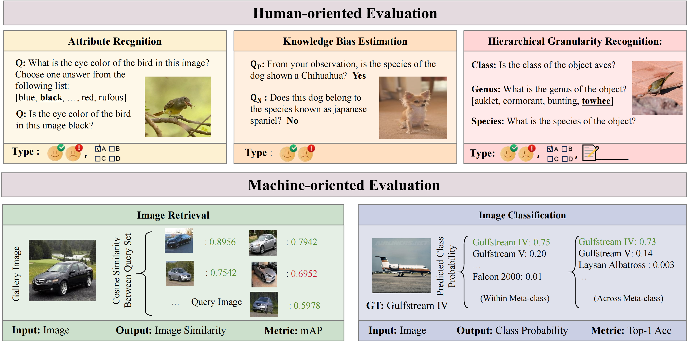

<div align="center">

<h1>
  &nbsp; FG-BMK
</h1>

<br/>

<a href="https://arxiv.org/abs/2606.19053">
  
</a>
<a href="https://arxiv.org/abs/2504.14988">
  
</a>
<a href="https://fg-bmk.github.io/">
  
</a>
<a href="https://github.com/SEU-VIPGroup/FG-BMK">
  
</a>

</div>

---

> 📄 This repository contains the **data** and **evaluation code** for **FG-BMK**.
> For an interactive leaderboard, dataset overview, and key findings, visit the **[project page](https://fg-bmk.github.io/)**.

## 🔔 News

- 🔥 (***new***) An extended version of our paper is now on [arXiv](https://arxiv.org/abs/2606.19053).
- ✨ Major benchmark update — we added new dataset and expanded the suite with additional experimental validation and analysis.
- 🎉 Our paper has been **accepted to ICLR 2026**! The ICLR version is available on [arXiv](https://arxiv.org/abs/2504.14988).
- 🚀 We released our **FG-BMK** benchmark!

## 📖 Introduction

<p align="center">
  
</p>

**FG-BMK** is a comprehensive fine-grained evaluation benchmark — **1.01 million questions** over **0.28 million images** — providing a robust test bed for evaluating LVLMs. It incorporates two complementary evaluation paradigms:

- **🧑 Human-oriented evaluation** — employs dialogue-like interactions to assess a model's ability to understand and respond to fine-grained visual queries in a conversational context.
- **🤖 Machine-oriented evaluation** — focuses on two core fine-grained vision tasks, **image retrieval** and **recognition**, to directly measure the feature-representation capabilities of LVLMs.

Compared with existing efforts — which primarily focus on fine-grained classification or use a limited number of questions — FG-BMK enables a comprehensive assessment of LVLMs' fine-grained feature representation and semantic recognition abilities. Our evaluations of **eight open-source LVLMs/VLMs** uncover key findings on the influence of training paradigms, modality alignment, perturbation susceptibility, and fine-grained category reasoning on task performance.

---

# 🚀 Evaluation Guidelines

## 1. Dataset Preparation

Before running inference, download the corresponding dataset images. Links to the source dataset projects are provided below — you can download the datasets to any location:

| Dataset | Dataset | Dataset |
|:--|:--|:--|
| [FGVC-Aircraft (aircraft)](https://www.robots.ox.ac.uk/~vgg/data/fgvc-aircraft/) | [CUB-200-2011 (cub)](https://www.vision.caltech.edu/datasets/cub_200_2011/) | [DeepFashion (deepfashion)](http://mmlab.ie.cuhk.edu.hk/projects/DeepFashion.html) |
| [Oxford 102 Flower (flowers102)](https://www.robots.ox.ac.uk/~vgg/data/flowers/102/) | [Food-101 (food101)](https://data.vision.ee.ethz.ch/cvl/datasets_extra/food-101/) | [iNat2021 (iNat2021)](https://github.com/visipedia/inat_comp/tree/master/2021) |
| [Products-10K (products10k)](https://products-10k.github.io/challenge.html#downloads) | [SkinCon (skincon)](https://skincon-dataset.github.io/) | [Stanford Car (stanfordcar)](https://www.sighthound.com/products/alpr) |
| [Stanford Dog (stanforddog)](http://vision.stanford.edu/aditya86/ImageNetDogs/) | [VegFru (vegfru)](https://github.com/ustc-vim/vegfru) | [Wine (wine)](https://tianchi.aliyun.com/dataset/110147) |
| [MTARSI (mtarsi)](https://huggingface.co/datasets/amistele/MTARSI-fixed) | | |

- **Human-oriented evaluations** — questions are pre-generated for each image, e.g. `benchmark/human-oriented/attribute_recognition/cub_attribute_questions.jsonl`.
- **Machine-oriented evaluations** — dataset categories and the corresponding `train.csv` / `test.csv` splits live in directories such as `benchmark/machine-oriented/aircraft`.

## 2. Environment & Checkpoint Preparation

Our evaluation covers **eight LVLMs/VLMs**. The table below lists the project and checkpoint for each model, to help you configure the environment and download the relevant weights:

| Model Project | Checkpoint |
|:--|:--|
| [InternVL](https://github.com/OpenGVLab/InternVL) | [InternVL-Chat-V1.1](https://huggingface.co/OpenGVLab/InternVL-Chat-V1-1) |
| [LLaVA-1.5](https://github.com/haotian-liu/LLaVA) | [LLaVA-1.5-7B](https://huggingface.co/liuhaotian/llava-v1.5-7b) |
| [Qwen-VL](https://github.com/QwenLM/Qwen-VL) | [Qwen-VL-Chat](https://huggingface.co/Qwen/Qwen-VL-Chat) |
| [BLIP-2](https://github.com/salesforce/LAVIS/tree/main/projects/blip2) | [BLIP-2-FLAN-T5-XL](https://huggingface.co/Salesforce/blip2-flan-t5-xl) |
| [EVA-CLIP](https://github.com/baaivision/EVA/tree/master/EVA-CLIP) | [EVA02_CLIP_L_psz14_s4B](https://huggingface.co/QuanSun/EVA-CLIP/blob/main/EVA02_CLIP_L_psz14_s4B.pt) |
| [BEiT3](https://github.com/microsoft/unilm/blob/master/beit3/README.md) | [BEiT3-large-itc](https://github.com/addf400/files/releases/download/beit3/beit3_large_itc_patch16_224.pth) |
| [CoCa](https://github.com/mlfoundations/open_clip#fine-tuning-coca) | [CoCa-L](https://github.com/mlfoundations/open_clip#fine-tuning-coca) |
| [DINOv2](https://github.com/facebookresearch/dinov2) | [DINOv2-L](https://dl.fbaipublicfiles.com/dinov2/dinov2_vitl14/dinov2_vitl14_pretrain.pth) |

## 3. Inference

### 🧑 Human-oriented Evaluation

To use your own model and produce final answers, first modify the model-loading code in `human_evaluation_demo.py` to adapt it to your model. Here is an example of loading the **InternVL** model:

```python
# Load InternVL model, tokenizer, and image processor
from transformers import AutoModel, AutoTokenizer, CLIPImageProcessor
model = AutoModel.from_pretrained(
    args.model_path,
    torch_dtype=torch.bfloat16,
    low_cpu_mem_usage=True,
    use_flash_attn=True,
    trust_remote_code=True).eval().cuda()
tokenizer = AutoTokenizer.from_pretrained(args.model_path, trust_remote_code=True, use_fast=False)
image_processor = CLIPImageProcessor.from_pretrained(args.model_path)
```

The model then answers the questions through its inference code, e.g.:

```python
# Load images
image = Image.open(image_path).resize((448, 448))
pixel_values = image_processor(images=image, return_tensors='pt').pixel_values.to(torch.bfloat16).cuda()
# Generate response
generation_config = dict(max_new_tokens=1024, do_sample=True)
response = model.chat(tokenizer, pixel_values, prompt_text, generation_config)
```

After modifying the loading code, configure **`model-path`** (checkpoint), **`question-file`**, **`image-folder`** (path to the dataset), and **`answers-file`** (output path) in `run_human_demo.sh`, then run:

```bash
bash run_human_demo.sh
# The code splits the question file by the number of GPUs and runs inference concurrently.
```

The outputs are merged into a single file in the following format:

```json
{"question_id": 1, "image": "images/001.Black_footed_Albatross/Black_Footed_Albatross_0078_796126.jpg", "prompt": "Is the genus of the object geococcyx? Answer with yes or no.", "text": "No", "class": "no", "category": "generic"}
{"question_id": 2, "image": "images/001.Black_footed_Albatross/Black_Footed_Albatross_0003_796136.jpg", "prompt": "Is the genus of the object raven? Answer with yes or no.", "text": "No", "class": "no", "category": "generic"}
```

Finally, compute accuracy with `answer_acc.py`:

```bash
python answer_acc.py
```

> See the [example output](https://github.com/MrPetrichor/FG-BMK/blob/main/demo/human_evaluation/example_output.jsonl) for a detailed prediction-file format. We also provide reference inference code for **Qwen-VL** and **BLIP-2**.

### 🤖 Machine-oriented Evaluation

To evaluate an LVLM's feature-representation ability, first modify the feature-extraction code in `models.py`. Here is an example of **CoCa** feature extraction:

```python
def coca(model_name, pretrained, cache_dir):
    from open_clip import create_model_and_transforms

    def _hook(self, _, input, output):
        self.feat.append(output.transpose(0, 1))

    def get_intermediate_layers(self, x, n=1, return_class_token=True):
        self.feat = []
        self(x)
        class_tokens = [out[:, 0] for out in self.feat]
        outputs = [out[:, 1:] for out in self.feat]
        return tuple(zip(outputs, class_tokens))

    model, _, preprocess = create_model_and_transforms(model_name, pretrained, cache_dir=cache_dir)
    model = model.visual
    model.eval()
    model.cuda()
    model.__class__._hook = _hook
    model.__class__.get_intermediate_layers = get_intermediate_layers
    model.transformer.resblocks[-2].register_forward_hook(model._hook)
    model.transformer.resblocks[-1].register_forward_hook(model._hook)
    return model
```

In this module we use **`_hook`** and the defined **`get_intermediate_layers`** method to extract visual features from the last two layers of the vision encoder. We then concatenate the **cls token** and **image tokens** in the predefined order and return an instance of the **CoCa model**. Examples of visual feature extraction using **EVA-CLIP** and **Qwen-VL** are already provided in `model.py`.

Once modified, import the model in `eval_linear.py` or `eval_retrieval.py`:

```python
from dinov2.utils.config import setup
from models import coca
torch.backends.cudnn.benchmark = True
model = coca('coca_ViT-L-14', 'laion2b_s13b_b90k', '.cache')
config = setup(args)
autocast_dtype = torch.float16
```

Then run the demo:

```bash
python eval_linear.py
# or
python eval_retrieval.py
```

The output log will look like:

```
I20240504 13:34:23 16157 dinov2 helpers.py:103] Training  [    0/10000]  eta: 8:13:21  loss: 143.1147 (143.1147)  lr: 0.0005 (0.0005)  time: 2.960182  data: 2.449736  max mem: 2711
...
```

After the training process completes, the code automatically runs inference on the test set of the fine-grained dataset and reports the results.

---

## 📌 Citation

If you find FG-BMK useful for your research, please consider citing:

```bibtex
@article{yu2026fgbmk,
  title   = {Benchmarking Large Vision-Language Models on Fine-Grained Image Tasks: From Evaluation to Diagnosis},
  author  = {Yu, Hong-Tao and Xie, Chen-Wei and Peng, Yuxin and Belongie, Serge and Wei, Xiu-Shen},
  journal = {IEEE Transactions on Pattern Analysis and Machine Intelligence (TPAMI)},
  year    = {2026}
}
```

<div align="center">
<sub>For questions or issues, please open a <a href="https://github.com/SEU-VIPGroup/FG-BMK/issues">GitHub issue</a>.</sub>
</div>
